# JIGSAW - Derby

## Выполнил: Туракулов Исломбек Улугбекович

### Студент группы БПИ204

### Как запускать проект?

Мой проект разделен на два модуля: сервер (`ServerJigsaw`) и клиент (`ClientJigsaw`).

### Концептуальная модель системы

Я решил Вам показать, как Сервер общается с клиентом и как Клиент общается с сервером. Мои главные классы, которые в
целом отвечают за запросы и чтение для Сервера это `Client.java` а для Клиента это `ServerHandler.java`.

Каждый запрос - это текст в формате JSON. Мне было гораздо проще с ним работать, он понятен и эффективен.

|         Server         |         Client         |
|:----------------------:|:----------------------:|
|  | 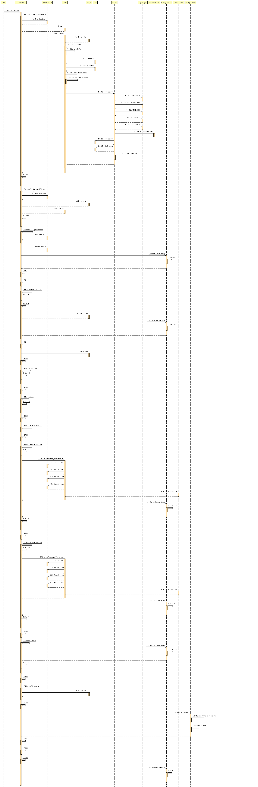 |

Entry point для каждого проекта это `App(-Launcher).java`

### Сценарий использования

Для плавной работы клиентской программы, я решил поместить логику обработки/отправки запроса в файлы `Game.java`
и `ServerHandler.java`. Ответ который я получаю от сервера обрабатывается в классе `ServerHandler.java`, для отправки
запроса использую `Game.java`.

Для работы с серверной частью я создал две страницы-формы:

1) Главное меню для работы с сервером (`ServerMainController.java`).
2) Страница для выбора игрового таймера для всех игр (`TimeFormController.java`).

#### Сервер

При запуске серверного приложения, пользователю изначально отображается следующее окно:

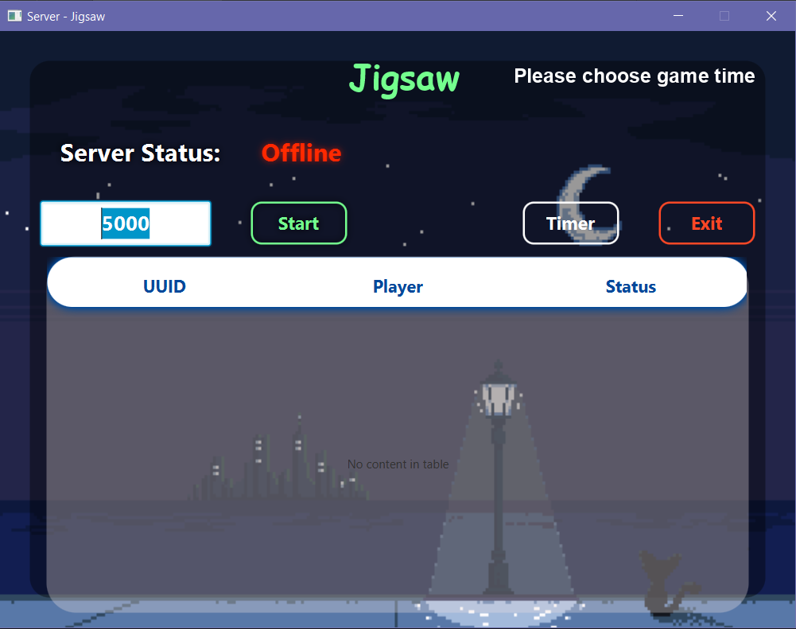

Сервер имеет возможность изменить порт сервера в случае какой-то блокировки со стороны интернета (в моём общежитии
блочат порты), но придётся Вам самому изменить для клиента порт для доступа к серверу. При выборе порта по-умолчанию всё
работает верно :)

При нажатии на кнопку "Start", происходит запуск сервера. Я добавил логирование логики программы для просмотра действий,
что происходит, отправляется и обрабатывается.

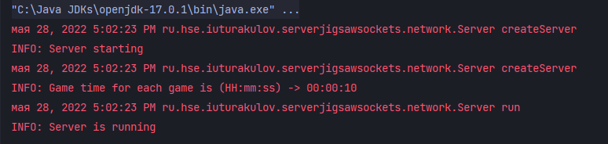

После запуска сервера, пользователю показывается кнопка для остановки сервера "Stop". При нажатии на данную кнопку
происходит остановка сервера.

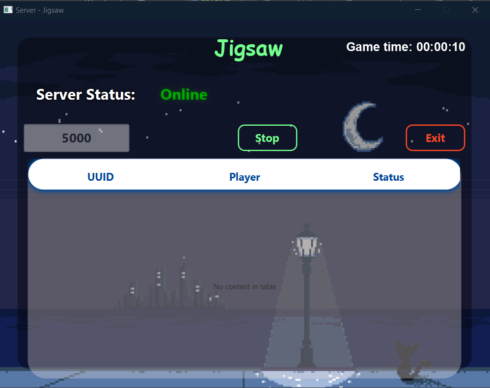

При нажатии на кнопку "Exit" происходит остановка сервера (если он был ранее запущен) и выход из приложения.

Соответственно для выбора игрового времени нужно нажать на кнопку с текстовым описанием "Timer". При нажатии на данную
кнопку происходит переход на страницу выбора игрового таймера.

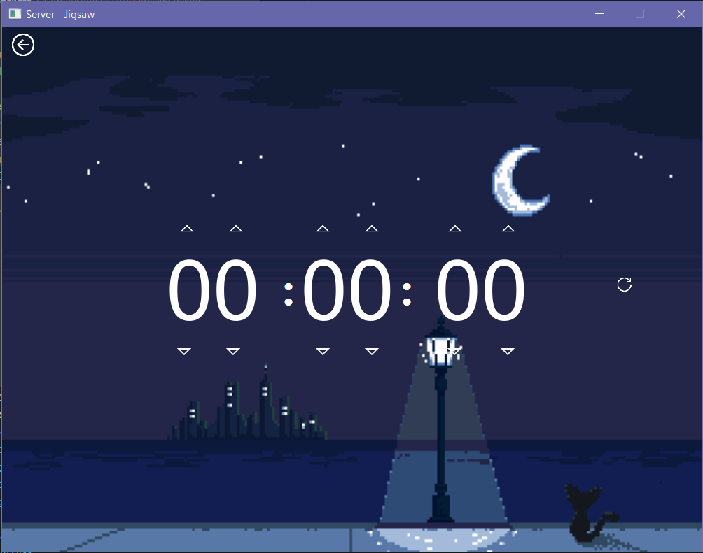

При авторизации пользователя на сервер, происходит обработка заявки и добавления юзера в таблицу (для удобства контроля
пользователей).

> Столбец UUID - уникальный идентификатор авторизированного пользователя. Следовательно, допускается авторизация идентичных имён.

> Столбец Player - никнейм авторизированного пользователя

> Столбец Status - авторизированный пользователей онлайн или нет (не вышел ли он с сервера).

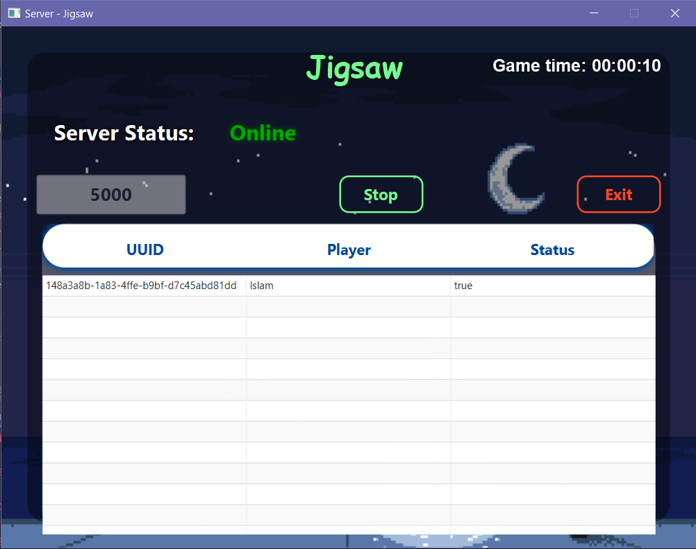

JSON запрос для авторизации, который был прочитан от пользователя.

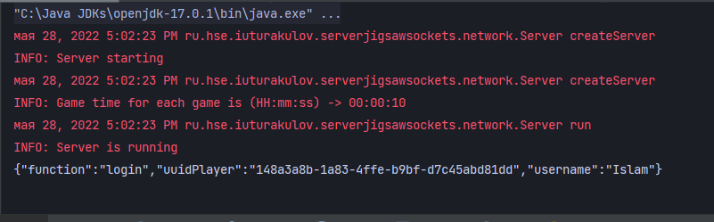

База данных и его запуск хранится в классе `DatabaseDerbyAccess.java`, там же происходит проверка на существование
таблицы и его создание. Ручной запуск не требуется, сервер по нужде сможет запустить и обработать данные с бд.

Пожалуйста, перед тем, как запускать серверное приложение, не забудьте поставить в конфигурации проекта сервера (Working
directory) или можете оставить как есть, сервер создаст сам бд в директории `./JigsawSocketsDerby/server`

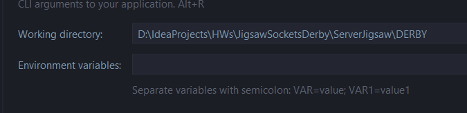

#### Клиент

При запуске клиентского приложения, пользователю показывается страница авторизации `LauncherFormController.java`. Прошу
заметить, что минимальная длина имени пользователя равна трём, а максимальная десяти. Ошибки обрабатываются через Dialog
окна.

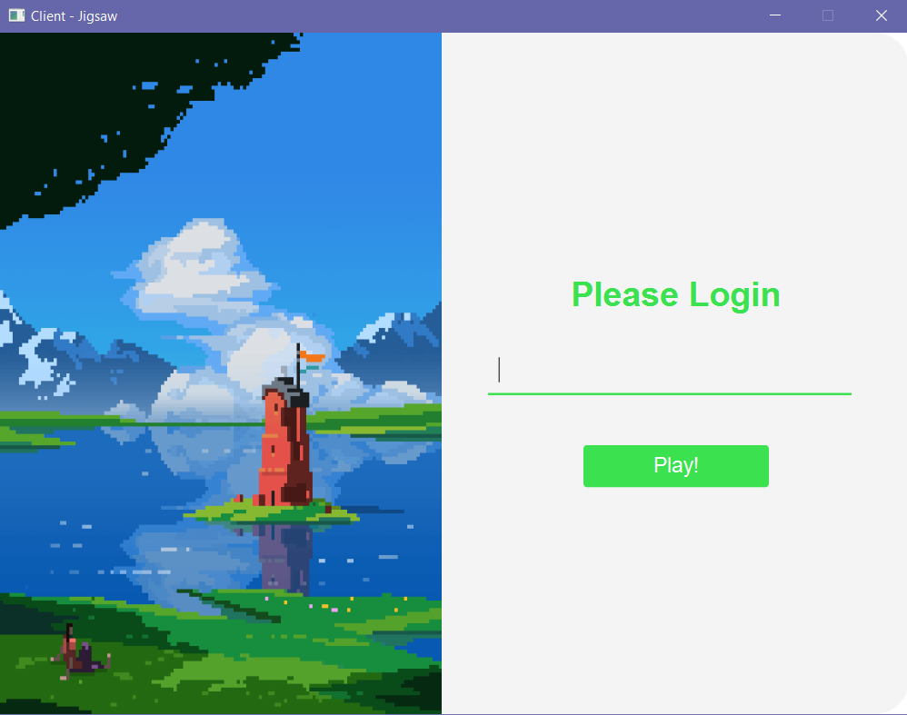

Если по каким-то обстоятельствам сервер не доступен для подключения, пользователь автоматически перебрасывает на
страницу авторизации с Dialog окном об ошибке.

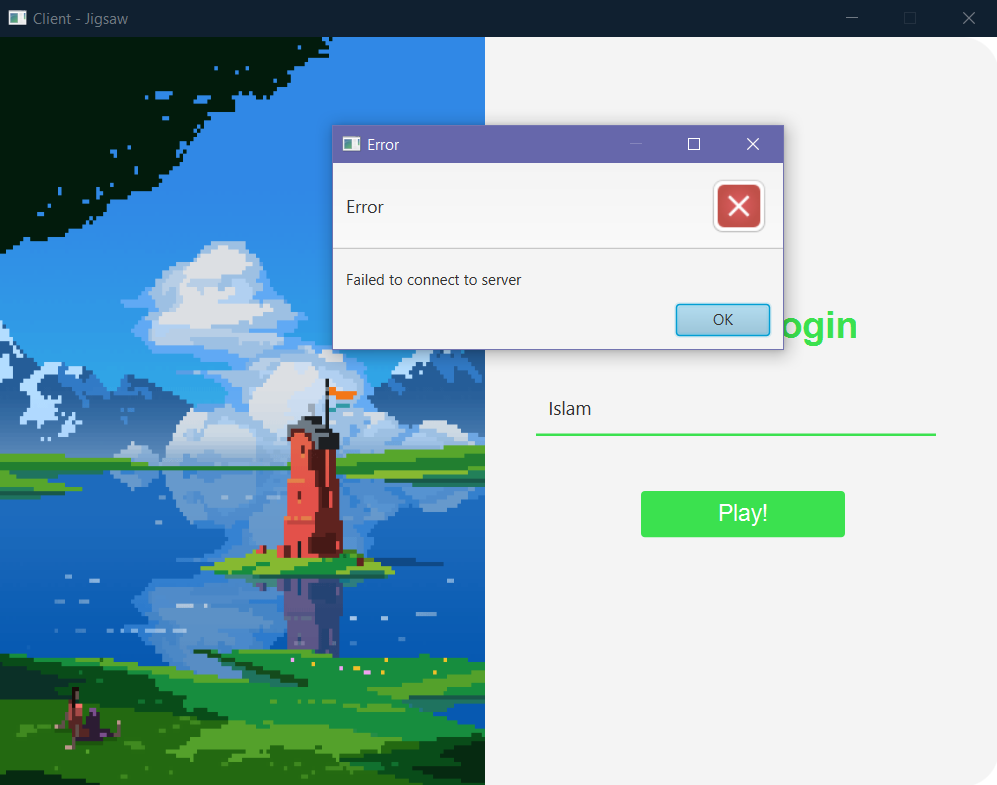

После успешной авторизации, пользователю показывается главный экран `MainFormController.java` выбора различных страниц:
одиночная игра, мультиплеерная игра, посмотреть топ 10 пользователей и выход с программы.

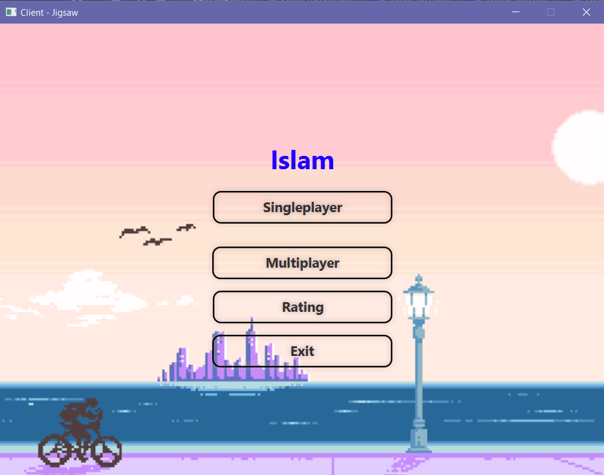

При нажатии на кнопку "Singleplayer" (`GameFormController.java`), происходит переход на страницу прохождения игры.

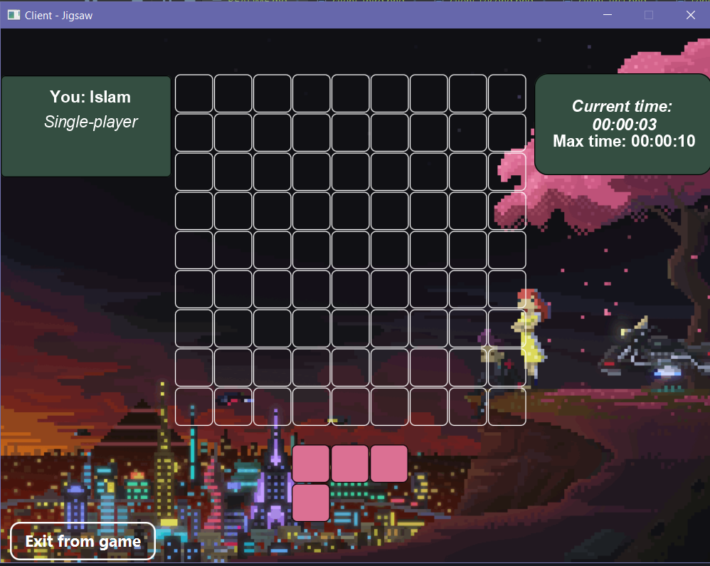

После завершения игры, пользователю показывается кнопка для повторения игрового процесса и результаты игры.

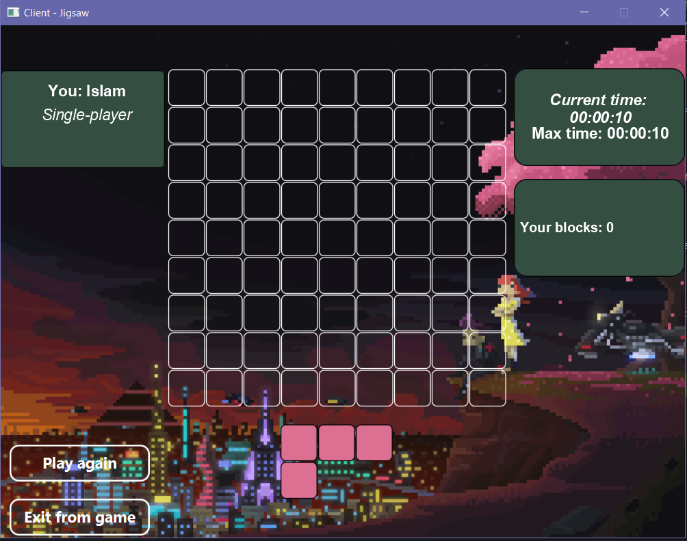

При нажатии на кнопку "Play again", игра начинается заново с новым генерацией блоков. При нажатии на кнопку "Exit from
game", происходит выход на главный экран `MainFormController.java`.

При нажатии на кнопку "Multiplayer" (`MultiplayerFormController.java`), происходит переход на страницу выбора игрока из
списка доступных участников. Кнопка "Refresh list", отвечает за обновление списка участников (вдруг кто-то ещё
присоединился на сервер). Кнопка "Invite player", отвечает за отправку заявки на игру. Оппонент может отклонить игру или
принять.

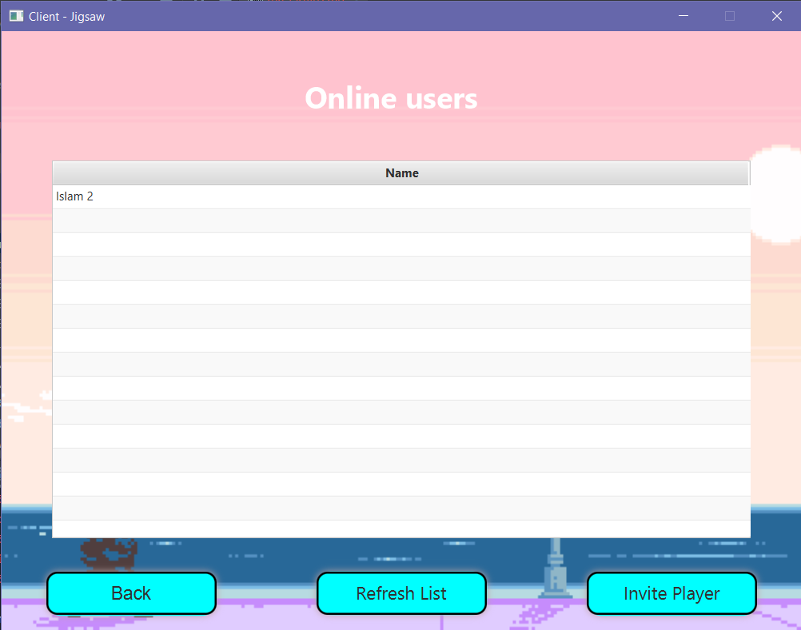

При отправке запроса на игру, оппоненту высвечивается окно для подтверждения запроса. Он может принять или отклонить
заявку. Все события обрабатываются.

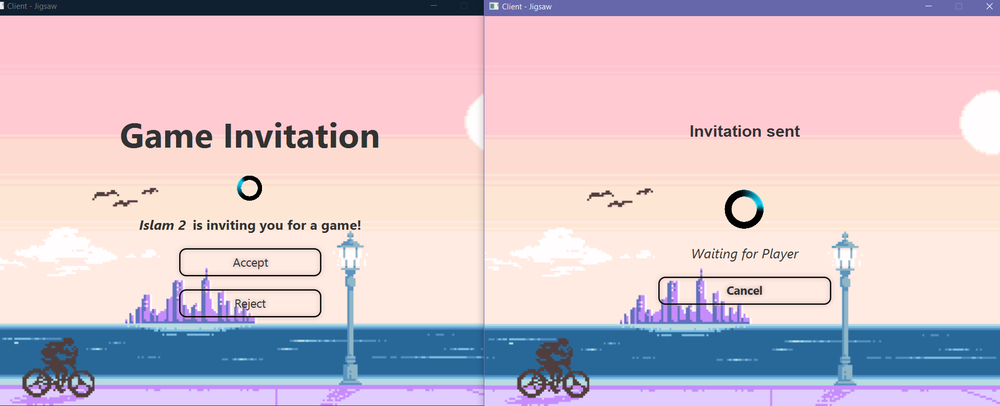

При нажатии на кнопку "Accept", происходит переход на игровую зону `GameFormController.java`, где каждый играет на своём
поле.

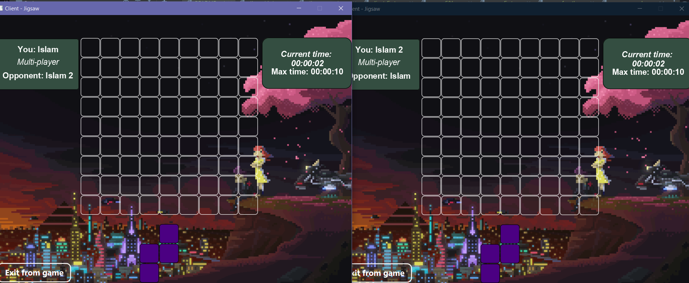

После завершения игры объявляется победитель. Логика результата и кнопок точно такая же, как была описана выше.

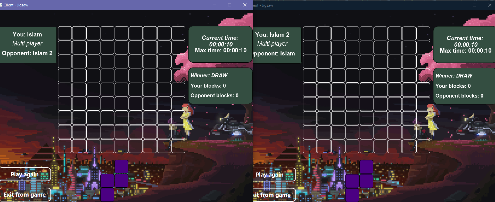

Если любой из двух играющих выходят из игры, появляется автоматический показ победителя.

При нажатии на кнопку "Rating", происходит переход на страницу топ 10 пользователей.

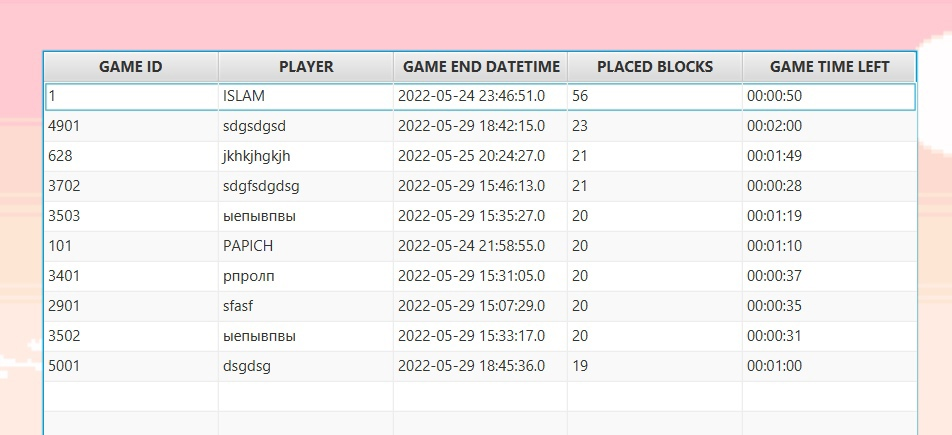

Таблица состоит из пяти столбцов:

1) GAME ID - уникальный идентификатор игры
2) PLAYER - Игровое имя пользователя
3) GAME END DATETIME - Дата и время завершения игры
4) PLACED BLOCKS - количество ходов
5) GAME TIME LEFT - сколько времени прошло в данной игре

Запрос на данные происходят аналогично через JSON запросы на сервер. Сервер получает и сортирует данные.
Каждый запрос на базу данных проверяется на наличие самой таблицы с данными. Если таблица отсутствует или она была
удалена, происходит пересоздание таблицы, иначе используется текущий.

При нажатии на кнопку "Refresh list", происходит обновление данных таблицы.

> Я хочу уточнить, что в ТЗ не было подробно описано про какую БД идёт речь. Единая БД или отдельная для пользователя. Но ведь по сути если подумать, пользователь смотрит достижения других играющих на сервере и сможет побить рекорд. Я думаю единое бд является более логичным.

### Тесты

Тесты к сожалению отсутствуют. Надеюсь данный пункт не сильно уменьшит мою оценку за данное домашнее задание.

### JAR файлы

У меня они имеются, находятся в папке cmd, однако при тестировании возникают ошибки, что нехватает компонент
javafx.controls, хотя программа запускается и в терминале запуска была добавлена недостающая компонента. Очень
странно...

### Может быть полезно

Надеюсь, Вы прочитали мой README и теперь сможете протестировать мой проект :)

> Я ещё хотел сделать онлайн игру по сети, но теоретические знания не позволили мне осуществить данную реализацию. Если Вы знаете как сделать данную реализацию, прошу подсказать мне. Спасибо!

Использованы следующие компоненты для реализации последнего домашнего задания:

1) GSON
2) org.json
3) java.logging
4) org.apache.derby

[Нажмите сюда, чтобы установить SDK JavaFX](https://download2.gluonhq.com/openjfx/18.0.1/openjfx-18.0.1_windows-x64_bin-sdk.zip)